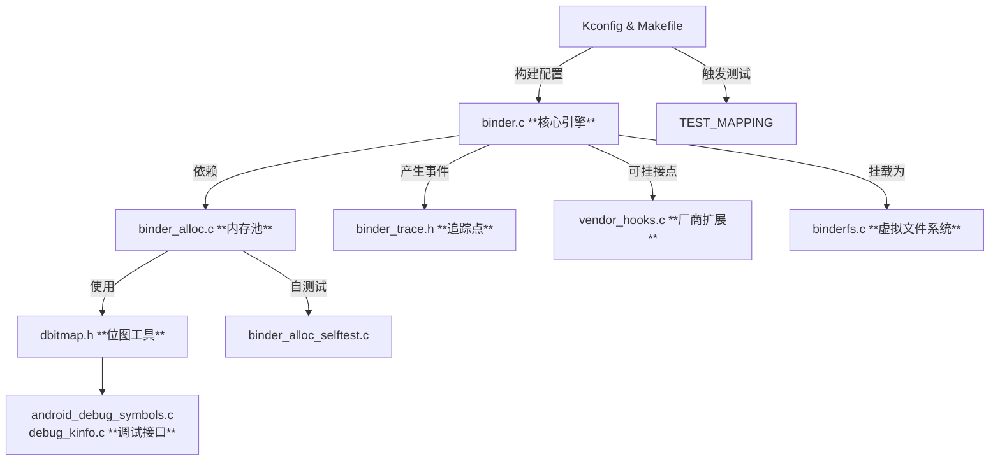

# 第二章 Binder驱动

先从驱动端讲起，先了解驱动提供了什么能力，然后在了解native层如何使用这些能力。

### 1. 目录结构

首先，默认的aosp代码中不包含kernel代码的，所以kernel代码需要单独下载，可以从下面地址clone kernel代码：

> `git clone https://android.googlesource.com/kernel/common`

或者使用国内清华镜像

> `git clone https://mirrors.tuna.tsinghua.edu.cn/git/AOSP/kernel/common.git`

下载后driver文件所在目录
```bash
.
├── drivers/android/
│   ├── Kconfig                   # 内核编译配置菜单。当你运行 make menuconfig 并导航到 Device Drivers -> Android 时，看到的选项（如 CONFIG_ANDROID_BINDER_IPC）就定义于此。
│   ├── Makefile                  # 构建脚本。根据 Kconfig 的选择，决定将哪些文件（如 binder.o, binder_alloc.o）编译进内核或模块。
│   ├── TEST_MAPPING
│   ├── android_debug_symbols.c
│   ├── binder.c                  # Binder IPC 驱动的主文件，
│   ├── binder_alloc.c            # Binder专用内存分配器的实现。
│   ├── binder_alloc.h
│   ├── binder_alloc_selftest.c   # 内存分配器的自测试代码。
│   ├── binder_internal.h
│   ├── binder_trace.h
│   ├── binderfs.c                # Binder文件系统（BinderFS）的实现。
│   ├── dbitmap.h                 # 用于高效管理内存页的分配状态，是 binder_alloc 的一个底层组件。
│   ├── debug_kinfo.c
│   ├── debug_kinfo.h
└── └── vendor_hooks.c            # 供应商挂钩实现。
```



### 2. 优越性

Binder作为Android中主要的IPC通信机制之一（在系统中还有很多其他IPC通信机制，视场景而定），相比传统Linux IPC（如管道、消息队列、Socket等）具有显著优越性，**其核心设计目标是：在资源受限的移动设备上，为大量、高频的跨进程通信提供高性能、高安全性和易于使用的框架。**

其优越性主要体现在以下几个方面：

📊 **Binder vs. 传统Linux IPC 核心对比**

| 特性维度 | Binder的优越性体现 |
| :--- | :---: |
| **性能** | **一次拷贝** 内存效率极高，延迟更低 |
| **安全性** | 基于进程UID/PID的**身份标识**与**能力控制** 内核保障，系统级安全模型 |
| **易用性** | **面向对象**（调用远程方法如同本地）、**自动代理生成** 开发者友好，降低出错率 |
| **稳定性** | **引用计数**与**生命周期管理** 由驱动管理，避免资源泄漏 |
| **设计理念** | **C/S架构**，结构清晰，与Android组件化架构完美契合 |

而这些特性中的一次拷贝是基于什么原理，就是在驱动中体现的。

